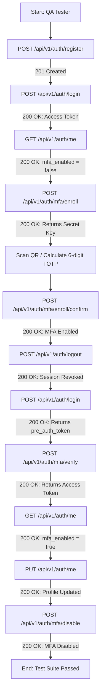

# PawGuard Authentication & MFA QA Testing Guide

This document is the official QA testing guide for the **PawGuard Authentication & Multi-Factor Authentication (MFA)** backend module. It provides a visual flowchart, exact step-by-step endpoints, expected HTTP status codes, request headers, JSON payloads, and automated test scripts.

---

## 1. Authentication & MFA Lifecycle Flowchart



---

## 2. Environment & Base URL

* **Live Staging Server:** `https://pawguard-backend-mqri.onrender.com`
* **Interactive OpenAPI / Swagger UI:** `https://pawguard-backend-mqri.onrender.com/docs`

---

## 3. Step-by-Step Testing Guide for QA Team

### Step 1: User Registration
* **API Endpoint:** `POST /api/v1/auth/register`
* **Headers:** `Content-Type: application/json`
* **Request Body:**
```json
{
  "email": "qa.tester@example.com",
  "password": "StrongP@ssw0rd99!",
  "full_name": "QA Lead Tester",
  "phone": "+1-555-0199"
}
```
* **Expected Status Code:** `201 Created`
* **Expected Response:**
```json
{
  "success": true,
  "data": {
    "id": "d4647278-8957-4eb7-8a2b-8ce8664c3518",
    "email": "qa.tester@example.com",
    "full_name": "QA Lead Tester",
    "phone": "+1-555-0199",
    "is_verified": false,
    "mfa_enabled": false,
    "roles": ["general_public"]
  },
  "message": "Registration successful. Please verify your email."
}
```

---

### Step 2: Primary User Login
* **API Endpoint:** `POST /api/v1/auth/login`
* **Headers:** `Content-Type: application/json`
* **Request Body:**
```json
{
  "email": "qa.tester@example.com",
  "password": "StrongP@ssw0rd99!"
}
```
* **Expected Status Code:** `200 OK`
* **Expected Response:** Returns `access_token`, `refresh_token`, and user details.
* **QA Action:** Copy the `access_token` for subsequent authorized requests.

---

### Step 3: Check Current Profile (`/me`)
* **API Endpoint:** `GET /api/v1/auth/me`
* **Headers:**
  - `Authorization: Bearer <access_token>`
  - `accept: application/json`
* **Expected Status Code:** `200 OK`
* **Verification Points:** Check that `mfa_enabled` is `false` and `phone` is `"+1-555-0199"`.

---

### Step 4: Initiate MFA Enrollment
* **API Endpoint:** `POST /api/v1/auth/mfa/enroll`
* **Headers:**
  - `Authorization: Bearer <access_token>`
  - `accept: application/json`
* **Request Body:** `{}` (Empty)
* **Expected Status Code:** `200 OK`
* **Expected Response:**
```json
{
  "success": true,
  "data": {
    "secret": "AOGKJY5GGRTWK2ZX4ELLGVBEXH4ZFYP5",
    "provisioning_uri": "otpauth://totp/PawGuard:qa.tester%40example.com?secret=AOGKJY5GGRTWK2ZX4ELLGVBEXH4ZFYP5&issuer=PawGuard"
  },
  "message": null
}
```
* **QA Action:** Copy the `secret` (e.g. `AOGKJY5GGRTWK2ZX4ELLGVBEXH4ZFYP5`). Enter it into Google Authenticator app or generate a live 6-digit TOTP code.

---

### Step 5: Confirm MFA Enrollment
* **API Endpoint:** `POST /api/v1/auth/mfa/enroll/confirm`
* **Headers:**
  - `Authorization: Bearer <access_token>`
  - `Content-Type: application/json`
* **Request Body:**
```json
{
  "code": "132088"
}
```
*(Replace `132088` with the active 6-digit TOTP code from your authenticator).*
* **Expected Status Code:** `200 OK`
* **Expected Response:**
```json
{
  "success": true,
  "data": null,
  "message": "MFA enabled."
}
```

---

### Step 6: Login with MFA Enabled (Two-Step Verification)

Now that MFA is enabled, logging in triggers the **Pre-Auth** workflow:

#### Step 6A: Initiate Login
* **API Endpoint:** `POST /api/v1/auth/login`
* **Request Body:**
```json
{
  "email": "qa.tester@example.com",
  "password": "StrongP@ssw0rd99!"
}
```
* **Expected Status Code:** `200 OK`
* **Expected Response:**
```json
{
  "success": true,
  "data": {
    "mfa_required": true,
    "pre_auth_token": "eyJhbGciOiJSUzI1NiIsInR5cCI6IkpXVCJ9..."
  },
  "message": null
}
```
* **QA Action:** Copy the `pre_auth_token`.

#### Step 6B: Complete MFA Login Verification
* **API Endpoint:** `POST /api/v1/auth/mfa/verify`
* **Headers:** `Content-Type: application/json`
* **Request Body:**
```json
{
  "pre_auth_token": "eyJhbGciOiJSUzI1NiIsInR5cCI6IkpXVCJ9...",
  "code": "822899"
}
```
*(Replace `code` with the current 6-digit TOTP code).*
* **Expected Status Code:** `200 OK`
* **Expected Response:** Returns final `access_token`, `refresh_token`, and user profile with `mfa_enabled: true`.

---

### Step 7: Profile Update Validation
* **API Endpoint:** `PUT /api/v1/auth/me`
* **Headers:**
  - `Authorization: Bearer <new_access_token>`
  - `Content-Type: application/json`
* **Request Body:**
```json
{
  "full_name": "QA Lead Verified",
  "phone": "+1-555-9988"
}
```
* **Expected Status Code:** `200 OK`
* **Validation Tests for QA:**
  1. Send `{}` $\rightarrow$ Returns `422 Unprocessable Entity` *(Empty body rejected)*
  2. Send `{"full_name": ""}` $\rightarrow$ Returns `422 Unprocessable Entity` *(Empty name rejected)*
  3. Send `{"phone": "invalid_phone"}` $\rightarrow$ Returns `422 Unprocessable Entity` *(Regex validation)*

---

### Step 8: Disable MFA
* **API Endpoint:** `POST /api/v1/auth/mfa/disable`
* **Headers:** `Authorization: Bearer <access_token>`
* **Request Body:**
```json
{
  "password": "StrongP@ssw0rd99!"
}
```
* **Expected Status Code:** `200 OK`
* **Expected Response:**
```json
{
  "success": true,
  "data": null,
  "message": "MFA disabled."
}
```

---

## 4. Automated Bash Test Script for QA Team

QA engineers using Git Bash / Linux / macOS can run this single command to test the entire lifecycle end-to-end automatically:

```bash
#!/usr/bin/env bash
set -e

BASE_URL="https://pawguard-backend-mqri.onrender.com/api/v1/auth"
EMAIL="qa.auto.$(date +%s)@example.com"
PASSWORD="StrongP@ssw0rd99!"

echo "1. Registering user $EMAIL..."
curl -s -X POST "$BASE_URL/register" \
  -H "Content-Type: application/json" \
  -d "{\"email\":\"$EMAIL\",\"password\":\"$PASSWORD\",\"full_name\":\"QA Auto\",\"phone\":\"+15550199\"}" > /dev/null

echo "2. Logging in..."
LOGIN_RESP=$(curl -s -X POST "$BASE_URL/login" \
  -H "Content-Type: application/json" \
  -d "{\"email\":\"$EMAIL\",\"password\":\"$PASSWORD\"}")

TOKEN=$(echo $LOGIN_RESP | .venv/Scripts/python -c "import sys, json; print(json.load(sys.stdin)['data']['access_token'])")

echo "3. Enrolling in MFA..."
ENROLL_RESP=$(curl -s -X POST "$BASE_URL/mfa/enroll" \
  -H "Authorization: Bearer $TOKEN" \
  -H "accept: application/json" -d "")

SECRET=$(echo $ENROLL_RESP | .venv/Scripts/python -c "import sys, json; print(json.load(sys.stdin)['data']['secret'])")

echo "4. Confirming MFA (Secret: $SECRET)..."
CODE=$(.venv/Scripts/python -c "import pyotp; print(pyotp.TOTP('$SECRET').now())")

curl -s -X POST "$BASE_URL/mfa/enroll/confirm" \
  -H "Authorization: Bearer $TOKEN" \
  -H "Content-Type: application/json" \
  -d "{\"code\":\"$CODE\"}" | grep -q "MFA enabled."

echo "5. Testing MFA Login Flow..."
LOGIN_MFA_RESP=$(curl -s -X POST "$BASE_URL/login" \
  -H "Content-Type: application/json" \
  -d "{\"email\":\"$EMAIL\",\"password\":\"$PASSWORD\"}")

PRE_TOKEN=$(echo $LOGIN_MFA_RESP | .venv/Scripts/python -c "import sys, json; print(json.load(sys.stdin)['data']['pre_auth_token'])")
CODE2=$(.venv/Scripts/python -c "import pyotp; print(pyotp.TOTP('$SECRET').now())")

VERIFY_RESP=$(curl -s -X POST "$BASE_URL/mfa/verify" \
  -H "Content-Type: application/json" \
  -d "{\"pre_auth_token\":\"$PRE_TOKEN\",\"code\":\"$CODE2\"}")

echo "MFA Login Success!"
echo "ALL QA TESTS PASSED SUCCESSFULLY!"
```
