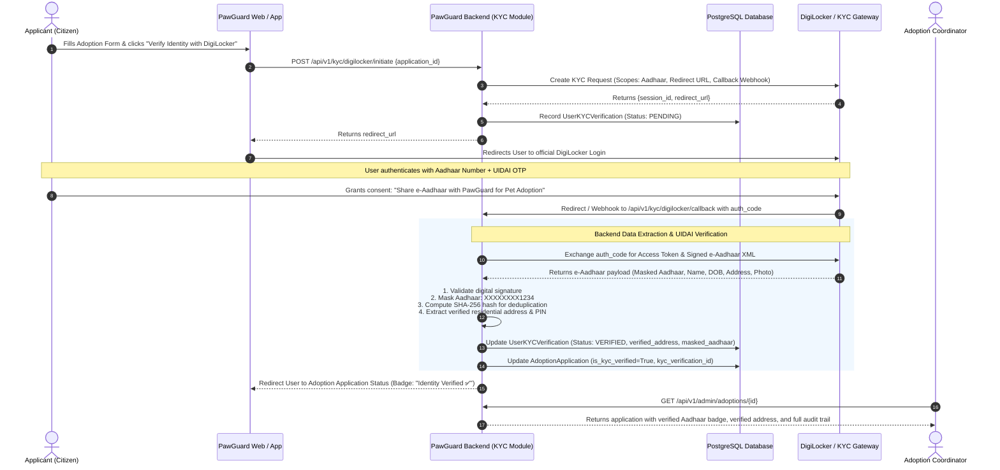

# PawGuard DigiLocker KYC Integration Architecture & Implementation Guide

**Document Reference**: `PG-ARCH-KYC-DIGILOCKER-2026-V1`  
**System**: PawGuard Dog Rescue & Shelter Management Platform  
**Target Modules**: Adoption Management, Citizen Identity & Legal Accountability  
**Version**: 1.0  
**Status**: APPROVED DESIGN SPECIFICATION  

---

## 1. Executive Summary & Problem Statement

### 1.1 The Challenge: Fraudulent Adoptions & Pet Abandonment
When citizens apply to adopt rescued dogs through PawGuard, bad actors or irresponsible applicants may provide:
* Fictitious full names and forged contact numbers.
* Fake or outdated residential addresses.
* Disposable identities to bypass background screening.

In tragic real-world scenarios, individuals adopt animals and abandon them on streets after 1–3 months, or subject them to neglect and cruelty. Without verified government credentials, shelters and law enforcement agencies cannot trace or hold the perpetrator legally accountable under the **Prevention of Cruelty to Animals Act, 1960** and relevant local municipal regulations.

### 1.2 The Solution: DigiLocker Government KYC Integration
By integrating **DigiLocker (National e-Governance Division - MeitY / UIDAI ecosystem)** into PawGuard's Adoption Workflow:
1. Every adoption applicant authenticates through their official government DigiLocker account via UIDAI Aadhaar OTP.
2. PawGuard programmatically extracts and cryptographically validates the citizen's **Official Legal Name**, **Date of Birth**, **Gender**, **Permanent Residential Address**, and **Masked Aadhaar**.
3. A tamper-proof KYC verification certificate is permanently linked to the adoption application, guaranteeing 100% legal traceability before any dog leaves the shelter.

---

## 2. Regulatory, Legal & UIDAI Compliance Matrix

To strictly comply with the **Aadhaar Act, 2016**, the **Digital Personal Data Protection (DPDP) Act, 2023**, and UIDAI storage guidelines:

| Data Attribute | Policy | Compliance Standard & Storage Rule |
| :--- | :--- | :--- |
| **Raw 12-Digit Aadhaar Number** | ❌ **PROHIBITED** | Under Indian law, private entities without specific UIDAI offline-KYC licensing **must never store raw 12-digit Aadhaar numbers in plaintext**. Violations incur statutory penalties. |
| **Masked Aadhaar Number** | ✅ **MANDATORY** | Store only `XXXXXXXX1234` (first 8 digits masked, only last 4 digits visible). |
| **Aadhaar SHA-256 Hash** | ✅ **PERMITTED** | Salted cryptographic SHA-256 hash (`hash(aadhaar + salt)`) stored for deduplication and blacklisting repeat abusers across shelters without exposing the underlying identity number. |
| **Verified Legal Full Name** | ✅ **PERMITTED** | UIDAI-verified legal name extracted directly from signed XML payload. |
| **Verified Residential Address** | ✅ **PERMITTED** | Full address breakdown (House/Flat, Street, Locality, VTC/City, District, State, PIN code) extracted from DigiLocker e-Aadhaar. |
| **Verified Photo (JPEG/Base64)** | ✅ **PERMITTED** | Encrypted S3 storage for physical verification during home inspections and shelter handover. |
| **Explicit Consent Audit Trail** | ✅ **MANDATORY** | User consent text, timestamp (UTC), applicant IP address, and session metadata logged for evidentiary validity in court. |

---

## 3. Integration Architecture & Provider Options

```
┌─────────────────────────────────────────────────────────────────────────────┐
│                             PAWGUARD ECOSYSTEM                              │
│                                                                             │
│   ┌─────────────────────┐                  ┌────────────────────────────┐   │
│   │   Public Web /      │                  │   Adoption & KYC Service   │   │
│   │   Mobile Client     │                  │     (FastAPI Backend)      │   │
│   └──────────┬──────────┘                  └─────────────┬──────────────┘   │
└──────────────┼───────────────────────────────────────────┼──────────────────┘
               │                                           │                   
               │ 1. Initiate KYC Session                   │ 2. Create Session 
               ▼                                           ▼                   
┌─────────────────────────────────────────────────────────────────────────────┐
│                          DIGILOCKER / KYC GATEWAY                           │
│               (Setu / Signzy / IDfy / Direct NeGD MeriPehchan)              │
│                                                                             │
│   ┌─────────────────────────────────────────────────────────────────────┐   │
│   │ • Generates secure hosted authentication URL                        │   │
│   │ • Handles Aadhaar / MeriPehchan OTP with UIDAI                      │   │
│   │ • Requests explicit user consent for PawGuard Adoption KYC          │   │
│   │ • Issues Signed e-Aadhaar XML / Masked PDF payload                  │   │
│   └─────────────────────────────────────────────────────────────────────┘   │
└─────────────────────────────────────────────────────────────────────────────┘
```

### 3.1 Integration Strategy Evaluation

| Strategy | Recommended Provider | Pros | Cons |
| :--- | :--- | :--- | :--- |
| **Option A: KYC Aggregator Gateway** *(Recommended)* | **Setu (Pine Labs)**, **Signzy**, or **IDfy** | • Instant sandbox & rapid production rollout.<br/>• Out-of-the-box drop-in redirect & mobile webview SDK.<br/>• Automatic Aadhaar masking & XML parsing.<br/>• Webhook retries & 99.9% uptime SLA. | Per-transaction KYC verification fee (~₹5–15 per completed KYC). |
| **Option B: Direct NeGD MeriPehchan OAuth2** | **National e-Governance Division (MeitY)** | • Zero per-transaction aggregator fee.<br/>• Direct government integration. | • Requires lengthy formal government entity onboarding.<br/>• Requires corporate Digital Signature Certificates (DSC).<br/>• Complex XML signature verification. |

---

## 4. End-to-End KYC & Adoption Lifecycle



---

## 5. Database Schema Design

### 5.1 New Table: `user_kyc_verifications`

```sql
CREATE TYPE kyc_provider_enum AS ENUM ('digilocker_direct', 'digilocker_setu', 'signzy', 'idfy', 'manual_fallback');
CREATE TYPE kyc_status_enum AS ENUM ('PENDING', 'VERIFIED', 'REJECTED', 'EXPIRED');
CREATE TYPE kyc_doc_type_enum AS ENUM ('aadhaar', 'driving_licence', 'voter_id', 'passport');

CREATE TABLE user_kyc_verifications (
    id UUID PRIMARY KEY DEFAULT gen_random_uuid(),
    user_id UUID NOT NULL REFERENCES users(id) ON DELETE CASCADE,
    application_id UUID REFERENCES adoption_applications(id) ON DELETE SET NULL,
    
    provider kyc_provider_enum NOT NULL DEFAULT 'digilocker_setu',
    status kyc_status_enum NOT NULL DEFAULT 'PENDING',
    document_type kyc_doc_type_enum NOT NULL DEFAULT 'aadhaar',
    
    -- UIDAI Compliant Identifiers
    masked_id_number VARCHAR(32) NOT NULL,              -- 'XXXXXXXX1234'
    id_hash VARCHAR(64) NOT NULL,                       -- SHA-256(Aadhaar + Salt) for deduplication
    gateway_reference_id VARCHAR(128) UNIQUE,           -- Gateway transaction/request ID
    
    -- Verified Demographics (Direct from DigiLocker)
    verified_full_name VARCHAR(255) NOT NULL,
    verified_dob DATE,
    verified_gender VARCHAR(16),
    
    -- Verified Residential Address (Cannot be forged)
    verified_care_of VARCHAR(255),                      -- S/O, W/O, D/O
    verified_house VARCHAR(255),
    verified_street VARCHAR(255),
    verified_locality VARCHAR(255),
    verified_vtc_city VARCHAR(100),
    verified_district VARCHAR(100),
    verified_state VARCHAR(100),
    verified_pincode VARCHAR(10),
    verified_full_address TEXT NOT NULL,
    
    -- Security, Documents & Audit Log
    document_storage_key VARCHAR(500),                 -- Encrypted S3 Key for e-KYC PDF Certificate
    user_photo_storage_key VARCHAR(500),               -- Encrypted S3 Key for verified applicant photo
    consent_ip_address VARCHAR(64) NOT NULL,
    consent_user_agent VARCHAR(500),
    consent_timestamp TIMESTAMPTZ NOT NULL DEFAULT NOW(),
    verified_at TIMESTAMPTZ,
    
    created_at TIMESTAMPTZ NOT NULL DEFAULT NOW(),
    updated_at TIMESTAMPTZ NOT NULL DEFAULT NOW()
);

-- Performance & Query Indexes
CREATE INDEX idx_user_kyc_user_id ON user_kyc_verifications(user_id);
CREATE INDEX idx_user_kyc_app_id ON user_kyc_verifications(application_id);
CREATE INDEX idx_user_kyc_id_hash ON user_kyc_verifications(id_hash);
CREATE INDEX idx_user_kyc_status ON user_kyc_verifications(status);
```

### 5.2 Adoption Application Schema Extension
Extend `adoption_applications` table with direct KYC tracking columns:
* `is_kyc_verified`: `BOOLEAN NOT NULL DEFAULT FALSE`
* `kyc_verification_id`: `UUID REFERENCES user_kyc_verifications(id)`
* `identity_verification_notes`: `TEXT`

---

## 6. Backend API Contracts & Interface Specification

### 6.1 Initiate KYC Session
* **Endpoint**: `POST /api/v1/kyc/digilocker/initiate`
* **Access**: Authenticated Applicant (`citizen`)
* **Request**:
```json
{
  "application_id": "9b1deb4d-3b7d-4bad-9bdd-2b0d7b3dcb6d",
  "redirect_url": "https://pawguard.org/adoption/verify-success"
}
```
* **Response (200 OK)**:
```json
{
  "success": true,
  "verification_id": "c1a2b3c4-d5e6-7f80-1a2b-3c4d5e6f7a8b",
  "session_url": "https://app.setu.co/digilocker-bridge/session?id=setu_dl_987654321",
  "expires_in_seconds": 900
}
```

---

### 6.2 DigiLocker Callback / Gateway Webhook
* **Endpoint**: `POST /api/v1/kyc/digilocker/callback`
* **Access**: DigiLocker / Gateway Webhook Signature Verified
* **Payload**:
```json
{
  "event": "kyc.completed",
  "gateway_reference_id": "setu_dl_987654321",
  "status": "SUCCESS",
  "data": {
    "document_type": "aadhaar",
    "masked_aadhaar": "XXXXXXXX4589",
    "name": "Arjun Sharma",
    "dob": "1994-08-15",
    "gender": "M",
    "address": {
      "care_of": "S/O Ramesh Sharma",
      "house": "Flat 402, Green Glen Heights",
      "street": "Outer Ring Road, Bellandur",
      "locality": "Bellandur",
      "vtc": "Bengaluru",
      "district": "Bengaluru Urban",
      "state": "Karnataka",
      "pincode": "560103"
    },
    "photo_base64": "/9j/4AAQSkZJRgABAQAAAQABAAD...",
    "certificate_pdf_url": "https://gateway-storage/signed/dl_cert.pdf"
  }
}
```

---

### 6.3 Admin Verification Detail
* **Endpoint**: `GET /api/v1/admin/kyc/verifications/{verification_id}`
* **Access**: `adoption_coordinator`, `super_admin`, `shelter_manager`
* **Response**:
```json
{
  "verification_id": "c1a2b3c4-d5e6-7f80-1a2b-3c4d5e6f7a8b",
  "applicant_user_id": "a8f3b2c1-d4e5-6f7a-8b9c-0d1e2f3a4b5c",
  "application_id": "9b1deb4d-3b7d-4bad-9bdd-2b0d7b3dcb6d",
  "status": "VERIFIED",
  "provider": "digilocker_setu",
  "document_type": "aadhaar",
  "masked_id_number": "XXXXXXXX4589",
  "verified_full_name": "Arjun Sharma",
  "verified_dob": "1994-08-15",
  "verified_full_address": "Flat 402, Green Glen Heights, Outer Ring Road, Bellandur, Bengaluru, Karnataka - 560103",
  "verified_pincode": "560103",
  "photo_url": "https://s3.ap-south-1.amazonaws.com/pawguard-kyc/photos/c1a2b3c4.jpg?signed=...",
  "verified_at": "2026-09-07T10:15:30Z",
  "consent_ip_address": "49.37.142.88",
  "legal_traceability_status": "VALID_GOVERNMENT_RECORD"
}
```

---

## 7. Security, Fraud Prevention & Legal Audit Controls

1. **Anti-Duplication & Multi-Shelter Blacklist**:
   * If an adopter is reported for pet abuse or abandoning an animal in one shelter, their `id_hash` is flagged in the global blacklist.
   * If the same person attempts to adopt another animal at any other shelter in the network using a different phone number or email, the system immediately blocks the application upon DigiLocker verification.
2. **Address Discrepancy Alert**:
   * If the address declared on the web application form differs significantly in PIN code or city from the UIDAI-verified address, an automated **"Address Mismatch"** warning is flagged for shelter staff inspection.
3. **End-to-End Encryption (E2EE)**:
   * Identity payloads and verification documents are encrypted at rest with **AES-256-GCM** using AWS KMS / HashiCorp Vault managed keys.
   * Access to unmasked addresses and applicant photos is strictly role-governed and logged in `audit_logs`.

---

## 8. Rollout & Implementation Phases

| Milestone | Key Deliverables | Estimated Effort |
| :--- | :--- | :--- |
| **Phase 1: Database & KYC Domain Models** | • Create `UserKYCVerification` model & Alembic migration.<br/>• Add KYC foreign keys to `AdoptionApplication`. | 1 Day |
| **Phase 2: Gateway Integration & Mock Sandbox** | • Implement DigiLocker Client service (Setu/Signzy SDK + Mock Sandbox for testing).<br/>• Create `/initiate`, `/callback`, `/status` routers. | 2 Days |
| **Phase 3: Adoption Workflow Integration** | • Hook KYC verification into Phase 1 of Adoption Application.<br/>• Auto-advance adoption status upon successful verification. | 1 Day |
| **Phase 4: Frontend UI Badges & Admin Portal Review** | • Add "Verify with DigiLocker" button in Public Web application form.<br/>• Add "Aadhaar Verified ✅" card & address comparison in Shelter Manager dashboard. | 2 Days |
| **Phase 5: Compliance Audit & Production Deployment** | • End-to-end security & test suite execution (`pytest`, `mypy`, `ruff`).<br/>• Gateway production API key provisioning. | 1 Day |

---

## 9. Conclusion
Integrating DigiLocker KYC transforms PawGuard from an honor-system platform into a **fully legally compliant, fraud-resilient animal welfare network**. It provides shelter staff with absolute confidence in applicant identity and guarantees legal traceability to protect rescued animals for their entire lifetime.
