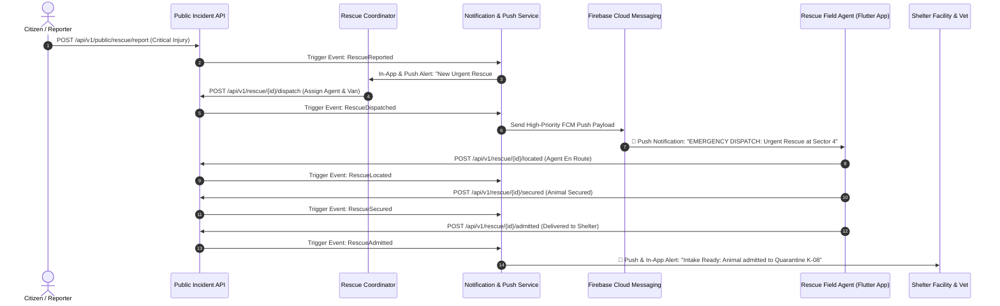
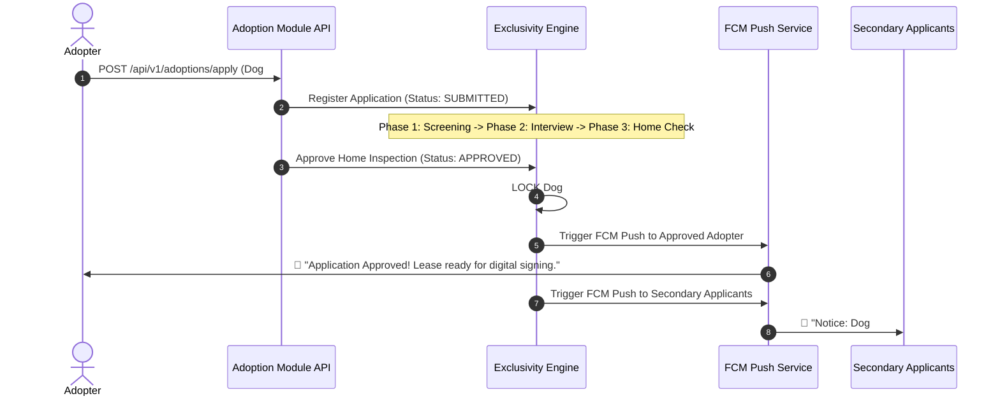

# PawGuard Notification & FCM Real-Time Push Engine

**Document Reference**: DOC-PAWGUARD-PUSH-NOTIF-2026-V1  
**Target Audience**: Software Engineering Team, Flutter Mobile Developers, System Architects, Operations Committee  
**Status**: APPROVED & PRODUCTION-READY  

---

## 1. Executive Summary & FCM Mobile Necessity

### 1.1 Alignment with Project Requirement Report (PRR)
PawGuard functions as the **centralized nervous system** for multi-regional animal rescue, shelter operations, veterinary diagnostics, and adoption management. As established in the **PRR Section 1.2 & Section 3.3**, field operations and rescue dispatches require **instantaneous, low-latency mobile alerts** for field agents, veterinarians, shelter managers, and executive coordinators.

### 1.2 Why Firebase Cloud Messaging (FCM) Push Notifications are Critical
While traditional web platforms rely on passive in-app notification centers or slow email digests, PawGuard's mobile ecosystem—specifically the **Rescue Staff Mobile Application** and **Executive Mobile Application**—demands **proactive real-time delivery**:

1. **Life-Threatening Incident Dispatches (PRR 3.2 & 3.3)**: Rescue agents in transit cannot continuously poll web endpoints. FCM high-priority push notifications pop up on field devices immediately when a coordinator dispatches a vehicle or team.
2. **Preventing Exclusivity & Adoption Double-Allocation (PRR 3.7)**: When an adoption application reaches *Home Inspection Approved*, the system locks the animal. FCM instantly notifies other applicants and staff.
3. **Medical Emergency & Triage Alerts (PRR 3.5)**: Critical intake diagnostics or surgical clearance requirements trigger push alerts to veterinarians on duty.
4. **Time-Sensitive Inventory Expiries (PRR 3.12)**: Automated alerts notify pharmacy managers when vaccine batches approach their 60-day expiration window.
5. **Grievance Response SLAs (PRR 3.14)**: Escalate response delays to Rescue Centre Admins when public incident complaints approach SLA limits.

---

## 2. End-to-End Rescue Operations Notification Flow



---

## 3. Module-by-Module Notification & Push Trigger Matrix

| Bounded Context / Module | Triggering Action | Recipient Role(s) | Delivery Channel(s) | Payload / Summary Content | PRR Reference |
| :--- | :--- | :--- | :--- | :--- | :--- |
| **Emergency Rescue** | Public Incident Reported | Rescue Coordinator, Rescue Admin | FCM Push, In-App | *"Urgent: New critical injury report at Sector 4."* | PRR 3.2 |
| **Emergency Rescue** | Team / Vehicle Dispatched | Assigned Rescue Agent, Driver | FCM Push (High Priority) | *"DISPATCH ASSIGNED: Vehicle #V-02 allocated for Case #RES-889."* | PRR 3.3 |
| **Emergency Rescue** | Incident Escalated in Field | Rescue Coordinator, Vet Team | FCM Push (Critical) | *"ESCALATION: Back-up & vet transport requested at site."* | PRR 3.3 |
| **Emergency Rescue** | Animal Admitted to Shelter | Shelter Manager, Vet | FCM Push, In-App | *"Intake Complete: Animal admitted to Quarantine Kennel K-08."* | PRR 3.2 / 3.6 |
| **Adoption Management** | Application Submitted | Adoption Coordinator | In-App, Email | *"New adoption application received for Dog #DOG-412."* | PRR 3.7 |
| **Adoption Management** | Home Inspection Approved | Applicant, Other Applicants | FCM Push, Email, In-App | *"Dog locked: Your application for Barnaby is approved for lease signing."* | PRR 3.7 |
| **Adoption Management** | Agreement Signed & Completed | Adopter | Email, FCM Push | *"Adoption Complete! Download your legal certificate & lease."* | PRR 3.7 |
| **Adoption Management** | 30 / 90 / 180 Day Follow-Up Due | Adopter | FCM Push, Email | *"Post-Adoption Check-in: Upload progress photos & health update."* | PRR 3.7 |
| **Veterinary Care** | Medical Clearance Granted | Adoption Officer, Shelter Mgr | In-App, FCM Push | *"Health Clearance: Barnaby cleared by Vet for Adoption Listing."* | PRR 3.5 |
| **Veterinary Care** | Vaccination Renewal Due | Veterinarian, Shelter Nurse | In-App, Email | *"Preventative Care: Rabies booster due for 5 kennel animals."* | PRR 3.5 |
| **Foster Management** | Foster Placement Assigned | Foster Parent | FCM Push, In-App | *"Placement Active: You have been assigned foster dog #DOG-104."* | PRR 3.8 |
| **Foster Management** | Supply Dispatch Prepared | Foster Parent | FCM Push | *"Supplies Dispatched: Food & medication package en route."* | PRR 3.8 |
| **Volunteer System** | Volunteer Shift Assigned | Volunteer | FCM Push, Email | *"Shift Scheduled: Shelter Duty at Central Facility tomorrow 09:00."* | PRR 3.9 |
| **Lost & Found Engine** | Match Confidence Score >90% | Pet Owner, Rescue Admin | FCM Push, Email | *"HIGH MATCH (92%): Found animal entry matches your lost report."* | PRR 3.10 |
| **Inventory & Pharmacy** | Stock Below Safety Threshold | Inventory Manager | FCM Push, In-App | *"ALERT: DHPP Vaccine stock below reorder threshold (10 units left)."* | PRR 3.12 |
| **Inventory & Pharmacy** | Product Expiry Warning (60 Days) | Inventory Manager, Vet | In-App, Email | *"EXPIRY WARNING: Batch #V-902 expires in 60 days."* | PRR 3.12 |
| **Grievance Assurance** | Public Complaint Submitted | Rescue Centre Admin | In-App, FCM Push | *"Grievance Ticket Logged: SLA countdown started (Response due in 4h)."* | PRR 3.14 |
| **Donations & Sponsorship** | Contribution Processed | Donor | Email, FCM Push | *"Receipt Issued: Thank you for your sponsorship gift of ₹2,500."* | PRR 3.11 |

---

## 4. Technical Architecture of PawGuard Notification Engine

PawGuard implements a **decoupled, multi-channel notification architecture**:

```
[ Domain Event / Service ]
           │
           ▼
[ NotificationService ] ──► Writes row to `notifications` DB table (In-App Inbox)
           │
           ├──────────────────────────────┐
           ▼                              ▼
 [ ARQ Background Worker ]       [ PushService ]
           │                              │
           ▼                              ▼
  [ Brevo Email API ]           [ Firebase Admin SDK (FCM) ]
           │                              │
           ▼                              ▼
[ User Email Inbox ]             [ Flutter Mobile App Push ]
```

### 4.1 Storage & Device Token Lifecycle
* **`User.fcm_token`**: Stored in PostgreSQL with index support (`index=True`) on the `users` table.
* **Token Registration**: Flutter client calls `PATCH /api/v1/auth/profile` passing `{ "fcm_token": "<TOKEN>" }` upon login or token refresh.
* **Fail-Closed Security**: Push failures are logged silently and never block database transactions or HTTP API responses.

---

## 5. Adoption & Exclusivity Workflow Sequence



---

## 6. Summary Checklist for Flutter Development Team

1. **SDK Setup**: Include `firebase_core` and `firebase_messaging` in `pubspec.yaml`.
2. **Token Registration**: Call `PATCH /api/v1/auth/profile` with `fcm_token` after authenticating with `POST /api/v1/auth/oauth/login` or `POST /api/v1/auth/login`.
3. **High-Priority Handlers**: Handle `android.priority = "high"` and `apns.sound = "default"` for emergency dispatch alerts.
4. **Deep Linking**: Inspect payload `data` key (e.g. `{ "rescue_request_id": "...", "type": "dispatch" }`) to navigate directly to the Rescue Case screen.
