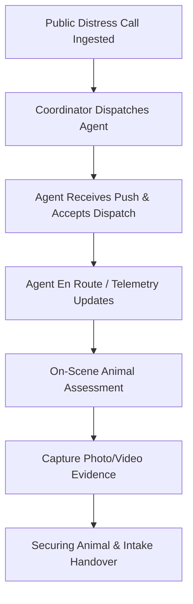
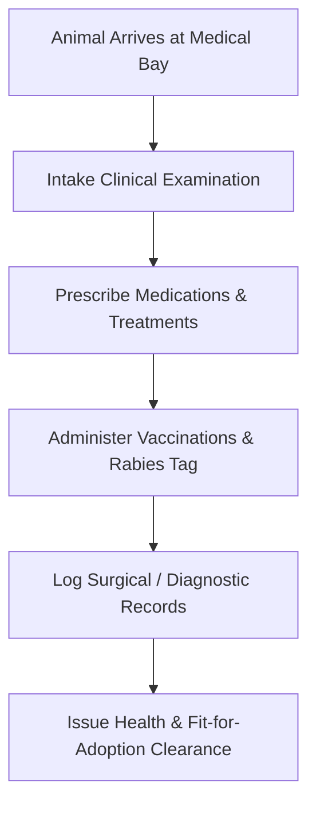

# PawGuard Platform — User Operations Manual

**Document ID:** PG-MAN-USER-2026-v1.0  
**Target Roles:** Field Rescue Agents, Veterinarians & Medical Staff, Shelter Managers, and Adoption Officers  
**Backend Target API:** `https://pawguard-backend-mqri.onrender.com/api/v1`  
**Classification:** OFFICIAL CONTRACTUAL USER MANUAL & PROCEDURAL GUIDE  

---

## 1. Document Overview & Objective

This manual provides authoritative, step-by-step operational workflows and API interaction specifications for all primary frontline operational roles within the PawGuard ecosystem. Every workflow documented here is fully backed by verified, transactional backend endpoints.

---

## 2. Field Rescue Agent Operations Guide

### 2.1 Role Purpose & Scope
The **Field Rescue Agent** (`rescue_agent`) is responsible for on-the-ground response to reported animal distress cases, physical securing of animals, capturing field telemetry/evidence, and transport intake.

### 2.2 Operational Workflow


### 2.3 Step-by-Step Field Execution Procedures

#### Step 1: Receiving and Accepting a Dispatch
1. When assigned an emergency dispatch, open the mobile app or call the endpoint:
   - **Endpoint:** `GET /api/v1/rescue/dispatches/my-dispatches`
   - **Authentication:** `Bearer <JWT>` (Role: `rescue_agent`)
2. To accept the dispatch:
   - **Endpoint:** `POST /api/v1/rescue/dispatches/{dispatch_id}/accept`
   - **Request Payload:** `{}`
   - **Expected Result:** Dispatch status moves to `ACCEPTED`.

#### Step 2: Transitioning to En Route & Scene Arrival
1. When departing for the location:
   - **Endpoint:** `POST /api/v1/rescue/dispatches/{dispatch_id}/en-route`
   - **Request Payload:** `{"current_lat": 12.9716, "current_lng": 77.5946}`
2. On scene arrival:
   - **Endpoint:** `POST /api/v1/rescue/dispatches/{dispatch_id}/arrive`

#### Step 3: Uploading Incident Evidence & Telemetry
1. Upload field photographs, videos, and situation assessments:
   - **Endpoint:** `POST /api/v1/rescue/requests/{request_id}/media`
   - **Payload:** `multipart/form-data` with `file`, `media_type="photo"`, and `caption="Front leg trauma observed"`.

#### Step 4: Securing the Animal & Transport Handoff
1. Once the animal is safely crated and under agent custody:
   - **Endpoint:** `POST /api/v1/rescue/requests/{request_id}/status`
   - **Payload:**
     ```json
     {
       "status": "secured",
       "notes": "Canine secured in transport crate #4. Transferring to City Central Shelter."
     }
     ```
   - **Outcome:** The rescue incident transitions to `SECURED`. The coordinating shelter receives real-time intake notice.

---

## 3. Veterinarian & Medical Staff Operations Guide

### 3.1 Role Purpose & Scope
The **Veterinarian** (`veterinarian`) manages triage examinations, diagnostic test logging, medical treatment administration, vaccination schedules, surgery execution, and medical clearance certificates.

### 3.2 Operational Workflow


### 3.3 Step-by-Step Clinical Execution Procedures

#### Step 1: Conducting Intake Clinical Examination
1. Retrieve animal record: `GET /api/v1/dogs/{dog_id}`
2. Create clinical examination record:
   - **Endpoint:** `POST /api/v1/medical/records`
   - **Payload:**
     ```json
     {
       "dog_id": "3fa85f64-5717-4562-b3fc-2c963f66afa6",
       "exam_type": "intake_triage",
       "temperature_celsius": 38.6,
       "weight_kg": 14.2,
       "body_condition_score": 4,
       "diagnosis": "Mild dehydration, laceration on left hind leg",
       "treatment_plan": "Wound dressing, subcutaneous fluid therapy, 5-day Amoxicillin course",
       "quarantine_required": true,
       "quarantine_days": 10
     }
     ```

#### Step 2: Prescribing Medications & Dosage Protocols
1. Add prescription:
   - **Endpoint:** `POST /api/v1/medical/records/{record_id}/prescriptions`
   - **Payload:**
     ```json
     {
       "medication_name": "Amoxicillin-Clavulanate 250mg",
       "dosage": "1 tablet twice daily",
       "duration_days": 7,
       "instructions": "Administer with wet food"
     }
     ```

#### Step 3: Logging Vaccinations & Safety QR Tag Provisioning
1. Register Anti-Rabies and DHPP vaccines:
   - **Endpoint:** `POST /api/v1/companion-pets/tags/vaccinations`
   - **Payload:**
     ```json
     {
       "dog_id": "3fa85f64-5717-4562-b3fc-2c963f66afa6",
       "vaccine_type": "Rabies",
       "batch_number": "RB-2026-991A",
       "administered_at": "2026-09-16T10:00:00Z",
       "next_due_date": "2027-09-16T10:00:00Z"
     }
     ```

#### Step 4: Medical Clearance Certificate Issuance
1. Mark animal medically cleared for foster or adoption:
   - **Endpoint:** `POST /api/v1/medical/records/{dog_id}/clearance`
   - **Payload:** `{"fit_for_adoption": true, "notes": "Fully vaccinated, neutered, and healed."}`
   - **Outcome:** The dog’s status unlocks for public adoption matching.

---

## 4. Shelter Manager Operations Guide

### 4.1 Role Purpose & Scope
The **Shelter Manager** (`shelter_manager`) oversees facility capacity, kennel allocations, intake processing, dietary logging, quarantine isolation, and inventory reconciliation.

### 4.2 Step-by-Step Shelter Execution Procedures

#### Step 1: Kennel Assignment & Intake Admission
1. Query available facility kennels:
   - **Endpoint:** `GET /api/v1/shelter/facilities/{facility_id}/kennels?status=available`
2. Register and kennel the admitted dog:
   - **Endpoint:** `POST /api/v1/dogs`
   - **Payload:**
     ```json
     {
       "name": "Bruno",
       "breed": "Indie / Mixed Breed",
       "gender": "male",
       "estimated_age_months": 24,
       "shelter_facility_id": "8fa85f64-5717-4562-b3fc-2c963f66afa1",
       "kennel_id": "9ca85f64-5717-4562-b3fc-2c963f66afa2",
       "intake_type": "rescue_transfer",
       "rescue_case_id": "1fa85f64-5717-4562-b3fc-2c963f66afa0"
     }
     ```

#### Step 2: Daily Kennel Care & Weight Monitoring
1. Log periodic weight measurements:
   - **Endpoint:** `POST /api/v1/dogs/{dog_id}/weight-logs`
   - **Payload:** `{"weight_kg": 15.1, "notes": "Weight gaining steadily"}`

---

## 5. Adoption Officer Operations Guide

### 5.1 Role Purpose & Scope
The **Adoption Coordinator** (`adoption_coordinator`) vets adopter applications, coordinates virtual/in-person home checks, enforces adoption exclusivity locks, generates legal adoption contracts, and manages post-adoption follow-ups.

### 5.2 Step-by-Step Adoption Execution Procedures

#### Step 1: Reviewing Application & Activating Exclusivity Lock
1. Retrieve pending applications:
   - **Endpoint:** `GET /api/v1/adoptions/applications?status=submitted`
2. Advance applicant to home check (This automatically activates the **Zero Exclusivity Violation Lock** on the dog):
   - **Endpoint:** `POST /api/v1/adoptions/applications/{application_id}/status`
   - **Payload:**
     ```json
     {
       "status": "home_check",
       "notes": "Preliminary phone screening passed; proceeding to home visit."
     }
     ```
   - **Safety Enforcement:** The backend issues a row lock (`FOR UPDATE`) on the dog. No other applicant can be moved to `HOME_CHECK` or `APPROVED` for this dog until released.

#### Step 2: Executing Legal Contract & Handover
1. Finalize adoption and generate digital agreement:
   - **Endpoint:** `POST /api/v1/adoptions/applications/{application_id}/contract`
   - **Payload:**
     ```json
     {
       "adopter_national_id": "ABCDE1234F",
       "contract_signed_at": "2026-09-16T12:00:00Z",
       "adoption_fee_paid": 0.00
     }
     ```
   - **Outcome:** The dog record status transitions to `ADOPTED`. Competing applications for this dog receive automatic closure notifications.

---
*End of User Operations Manual.*
