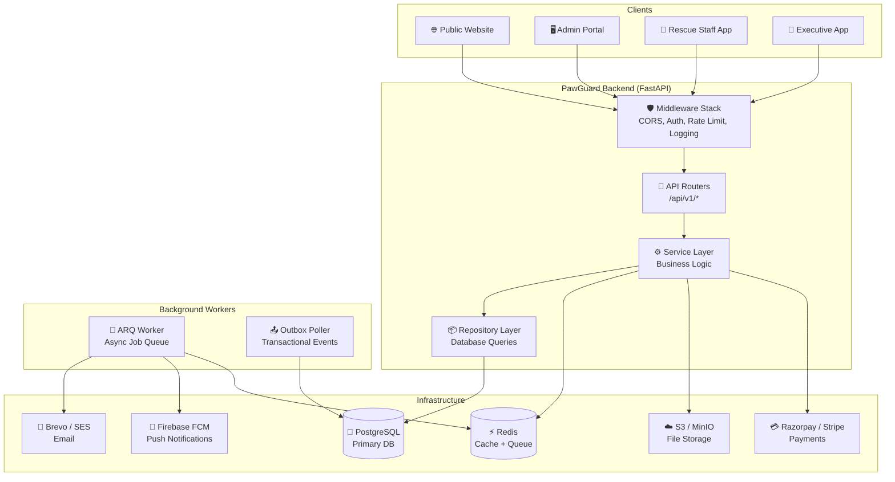

# 🐾 PawGuard Backend — Complete Architecture & Module Guide

> **Purpose**: This document explains every file, folder, module, and how the API → Service → Database pipeline works end-to-end. Written so you can confidently understand and explain every piece to clients, team leads, and architects.

---

## 1. High-Level Architecture



### Request Flow (Every single API call follows this)

```
Client Request
    ↓
Middleware Stack (Request ID → Logging → CORS → Security Headers → Body Size → Idempotency)
    ↓
Router (authenticate → authorise → validate input → call service)
    ↓
Service (business logic, validation, orchestration)
    ↓
Repository (SQL queries via SQLAlchemy 2.0 Async)
    ↓
PostgreSQL Database
    ↓
Response back up the chain
```

> **Mandatory Rule**: Routers NEVER touch the database directly. Business logic NEVER lives in routers. Repositories NEVER make business decisions.

---

## 2. Tech Stack Summary

| Layer | Technology | Purpose |
|-------|-----------|---------|
| **Framework** | FastAPI 0.141+ | Async REST API framework |
| **Language** | Python 3.13 | Runtime |
| **ORM** | SQLAlchemy 2.0 (async) | Database models & queries |
| **DB Driver** | asyncpg | Async PostgreSQL driver |
| **Migrations** | Alembic | Database schema versioning |
| **Auth** | PyJWT (RS256) + Argon2id / Bcrypt | JWT tokens + secure password hashing |
| **MFA** | PyOTP (TOTP) | Two-factor authentication |
| **Cache/Queue** | Redis 7 + ARQ | Caching & background job queue |
| **File Storage** | Boto3 (Amazon S3 / R2 / MinIO) | Image/document uploads & presigned URLs |
| **Email** | Amazon SES / Brevo API | Transactional emails |
| **Push Notifications** | Firebase Admin SDK | Mobile push via FCM |
| **Payments** | Razorpay / Stripe SDK | Donation & sponsorship processing |
| **PDF Generation** | ReportLab | Receipts, certificates, adoption agreements |
| **Logging** | structlog | Structured JSON logging |
| **Monitoring** | Custom Prometheus metrics | RED metrics, pool stats, health checks |

---

## 3. Complete Module-by-Module Breakdown (All 28 Modules)

### 1. `auth` — Authentication & Identity
* **What it does**: User registration, login, JWT token issuance (access + refresh), MFA (TOTP), OAuth2, password reset with secure tokens, and session invalidation.
* **Key Files**:
  * `router.py`: `/api/v1/auth/*` endpoints
  * `service.py`: Password hashing, token generation, MFA validation
  * `repository.py`: User and session database queries
  * `models.py`: `User`, `UserSession`, `RefreshToken`

### 2. `admin` & `admin_dashboard` — System Administration
* **What it does**: Role-based access control (RBAC), custom permissions, user management, system audit logs, and unified executive KPI metric aggregations.
* **Key Endpoints**: `/api/v1/admin/users`, `/api/v1/admin/roles`, `/api/v1/admin/dashboard/*`

### 3. `companion_pet` — Owned Pets & Safety Tags
* **What it does**: User pet registration, pet profiles, medical history, vaccination reminders, clinic access, and public QR safety tag generation & scanning.
* **Special Logic**: Canonical public QR scan contract returning real owner contact information for lost pet recovery.

### 4. `dog` — Shelter Master Dog Profiles
* **What it does**: Intake records, dog breed classification, health/behavioral temperaments, kennel location tracking, weight logs, and adoption readiness tracking.

### 5. `adoptions` — 6-Stage Adoption Pipeline
* **What it does**: Application submission, background vetting, home check scheduling, committee approval, digital adoption agreement generation (PDF), and post-adoption follow-up tracking.

### 6. `rescue` & `public_rescue` — Emergency Dispatch & Incident Triage
* **What it does**: Public distress reporting, geolocation dispatch, ambulance vehicle assignment, severity score calculation, and live rescue status updates.

### 7. `fleet` — Ambulance & Vehicle Management
* **What it does**: Rescue vehicle inventory, maintenance schedules, GPS tracking logs, driver assignments, and fuel consumption logs.

### 8. `shelter` — Facility & Kennel Management
* **What it does**: Facility sections, kennel assignment/sanitation logs, inter-shelter dog transfers, and daily care log tracking.

### 9. `medical` — Veterinary Care & Treatments
* **What it does**: Clinical examinations, vaccination schedules, deworming cycles, prescription logs, and medical clearance certificates.

### 10. `veterinary` — Partner Clinics & Veterinarians
* **What it does**: Veterinary network directory, doctor appointment scheduling, clinic membership plans, and electronic medical records (EMR).

### 11. `donations` — Crowdfunding & Sponsorships
* **What it does**: One-time donations, recurring dog sponsorships, campaign goals, Razorpay/Stripe webhooks, and automated 80G tax receipt generation.

### 12. `finance` — NGO Ledger & Expense Tracking
* **What it does**: Chart of accounts, double-entry transaction ledger, expense reimbursement approvals, budget allocations, and P&L financial reporting.

### 13. `lost_found` — Lost & Found Pet Matchmaker
* **What it does**: Lost dog reports, found stray sightings, image matching, radius broadcast alerts, and reunion story logging.

### 14. `fosters` — Foster Parent Placements
* **What it does**: Foster applications, home verification, dog placement agreements, supply requisitions, and foster-to-adopt conversions.

### 15. `volunteers` — Volunteer Coordination
* **What it does**: Volunteer onboarding, shift scheduling, attendance check-in/check-out, no-show tracking, and service hour certificates.

### 16. `inventory` — Shelter Supplies & Warehouse
* **What it does**: Food, medicine, and gear stock tracking, low-stock threshold alerts, warehouse transfers, and supplier management.

### 17. `grievance` — Feedback & Issue Tickets
* **What it does**: Public feedback collection, internal escalation tickets, SLA response tracking, and resolution comments.

### 18. `notifications` — Multi-Channel Alerts
* **What it does**: In-app notifications, push notification dispatch (FCM), notification preferences, and global broadcast messaging.

### 19. `portal` — Public CMS & Marketing Content
* **What it does**: Public success stories, educational blog posts, FAQ management, urgent rescue alerts, and legal terms pages.

### 20. `storage` — File Management & S3 Integration
* **What it does**: Secure pre-signed upload URLs, confirmation webhooks, download URLs, and bulk file cleanup.

### 21. `dashboards` — Real-Time Operations Dashboards
* **What it does**: Aggregated real-time metrics for rescue, medical, shelter, inventory, foster, and executive leadership.

### 22. `settings` — System Configuration
* **What it does**: Global platform settings, business rule configurations, password policies, and email template configurations.

---

## 4. Where to Find the Complete Documents in the Codebase

All comprehensive guides are located directly in your repository:

1. **Complete Architecture & Module Guide**: [`docs/architecture/pawguard_complete_architecture_guide.md`](file:///c:/Users/win10/Downloads/PAW-GUARD-/docs/architecture/pawguard_complete_architecture_guide.md)
2. **AWS Cloud & Capacity Planning Guide**: [`docs/deployment/infrastructure_and_capacity_plan.md`](file:///c:/Users/win10/Downloads/PAW-GUARD-/docs/deployment/infrastructure_and_capacity_plan.md)
3. **Live Latency Benchmark Report**: [`docs/performance_benchmark_report.md`](file:///c:/Users/win10/Downloads/PAW-GUARD-/docs/performance_benchmark_report.md)
4. **All API Endpoints Inventory (499+ Endpoints)**: [`docs/qa/all-endpoints.md`](file:///c:/Users/win10/Downloads/PAW-GUARD-/docs/qa/all-endpoints.md)
