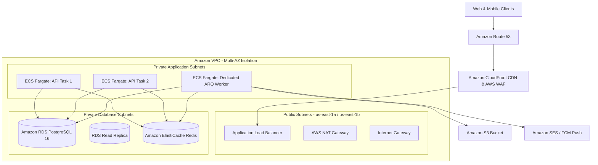

# PawGuard Production Infrastructure, Capacity Planning & AWS Sizing Guide

**Version**: 1.0  
**Target Environment**: AWS Enterprise Cloud Architecture  
**Backend Framework**: FastAPI (AsyncIO) + PostgreSQL 16 + Redis (ARQ Worker)  

---

## 1. Executive Summary & AWS Cloud Architecture

PawGuard backend is built as a high-throughput, microservice-ready system designed to run entirely on **Amazon Web Services (AWS)**. To guarantee sub-100ms API response times at scale and prevent background tasks (PDF generation, bulk email dispatch, push notification bursts) from consuming HTTP CPU cycles, the AWS infrastructure decouples workloads into dedicated containerized tiers:

1. **API Compute Tier**: Stateless, asynchronous FastAPI containers running on **Amazon ECS Fargate** behind an **Application Load Balancer (ALB)**.
2. **Worker Compute Tier**: Dedicated **Amazon ECS Fargate** tasks running ARQ workers pulling asynchronous jobs from **Amazon ElastiCache (Redis)**.
3. **Relational Database Tier**: **Amazon RDS PostgreSQL 16** with Multi-AZ replication, automated snapshots, and read replicas for analytical queries.
4. **Caching & Queue Tier**: **Amazon ElastiCache for Redis** for sub-millisecond query caching, rate limiting, and background task queuing.
5. **Storage & Edge Tier**: **Amazon S3** for media/document storage with global edge distribution through **Amazon CloudFront**.



---

## 2. Comprehensive AWS Enterprise Technology Stack

| Category | Infrastructure Component | AWS Service | Purpose & Engineering Role |
| :--- | :--- | :--- | :--- |
| **Networking** | **DNS Management** | **Amazon Route 53** | High-availability global DNS routing with latency-based and failover routing policies. |
| | **Edge Acceleration / CDN**| **Amazon CloudFront** | Low-latency global edge caching for media assets, public dog listings, and static content. |
| | **SSL / TLS Termination** | **AWS Certificate Manager (ACM)** | Automated provisioning and zero-maintenance renewal of SSL/TLS certificates on ALB. |
| | **Application Security** | **AWS WAF** | Layer 7 Web Application Firewall mitigating SQLi, XSS, automated scrapers, and Layer 7 DDoS. |
| | **Traffic Distribution** | **Application Load Balancer (ALB)** | Intelligent Layer 7 traffic routing, path-based routing, health checks, and SSL termination. |
| | **Network Isolation** | **Amazon VPC** | Isolated virtual network topology spanning across multiple Availability Zones (AZs). |
| | **Subnet Architecture** | **Public & Private Subnets** | Strict isolation: ALBs in public subnets; compute/databases in private subnets. |
| | **Outbound Connectivity** | **AWS NAT Gateway** | Allows private Fargate tasks to securely connect to external APIs (Payment gateways, FCM). |
| | **Access Control** | **Security Groups & NACLs** | State-aware virtual firewalls enforcing least-privilege port and IP access rules. |
| **Compute** | **Container Registry** | **Amazon ECR** | Secure, versioned, vulnerability-scanned Docker container image repository. |
| | **API Container Runtime** | **Amazon ECS Fargate (API)** | Serverless container execution for FastAPI with automatic task lifecycle management. |
| | **Worker Runtime** | **Amazon ECS Fargate (Worker)**| Dedicated serverless container execution for ARQ background jobs and PDF generation. |
| | **Auto Scaling** | **ECS Target Tracking Auto Scaling** | Dynamically scales API tasks based on CPU utilization (>70%) and ALB Request Count. |
| | **Deployment Strategy** | **ECS Rolling Deployment** | Zero-downtime rolling updates with automatic health check validation and rollback. |
| **Database & Cache**| **Primary Relational DB**| **Amazon RDS PostgreSQL 16** | Fully managed ACID database with Multi-AZ failover and automated minor version upgrades. |
| | **Read Scaling** | **Amazon RDS Read Replica** | Offloads read-heavy analytical dashboards, reports, and public dog searches. |
| | **In-Memory Cache & Queue**| **Amazon ElastiCache (Redis)** | High-throughput, sub-millisecond caching layer, rate-limiter, and ARQ queue broker. |
| | **Database Backups** | **Automated RDS Snapshots** | Automated daily snapshots with Point-in-Time Recovery (PITR) up to 35 days. |
| **Storage** | **Object Storage** | **Amazon S3 Standard** | Highly durable (99.999999999%) storage for pet safety photos, documents, and medical files. |
| | **Asset Optimization** | **Amazon S3 + CloudFront** | Edge-optimized static asset distribution with origin access control (OAC). |
| | **Disaster Recovery** | **AWS Backup** | Centralized, policy-driven backup management across RDS, S3, and EBS storage volumes. |
| **Messaging** | **Background Queuing** | **Redis on ElastiCache / SQS**| Native ARQ async job dispatcher for PDF contracts, email queues, and cache warmups. |
| | **Transactional Email** | **Amazon SES** | High-deliverability transactional email service for 80G tax receipts and adoption agreements. |
| | **Push & SMS Alerts** | **Amazon SNS / FCM** | Multi-channel SMS and mobile push notification delivery for emergency rescue dispatch. |
| **Security** | **Secrets Management** | **AWS Secrets Manager** | Centralized encryption, retrieval, and automated rotation of database and API credentials. |
| | **Configuration Store** | **AWS Systems Manager Parameter Store** | Secure, hierarchical storage for non-sensitive backend environment configurations. |
| | **Identity & Access** | **AWS IAM** | Role-based least-privilege IAM policies assigned directly to ECS Task Execution roles. |
| | **Data Encryption** | **AWS KMS** | Customer-managed encryption keys for data-at-rest in RDS, S3, and Secrets Manager. |
| | **Compliance & Audit** | **AWS CloudTrail** | Comprehensive logging of all AWS API activity and infrastructure modifications. |
| **Observability** | **Metrics & Logs** | **Amazon CloudWatch & Container Insights**| Centralized container metrics, CPU/memory alarms, request latency, and structured log groups. |
| | **Distributed Tracing** | **AWS X-Ray / OpenTelemetry**| End-to-end request tracing tracking latency bottlenecks across API, DB, and Redis calls. |
| **CI/CD & IaC** | **Continuous Integration**| **GitHub Actions** | Automated linting, type-checking (`mypy`), unit testing, and Docker build pipeline. |
| | **Infrastructure as Code**| **Terraform (AWS Provider)** | 100% reproducible, version-controlled modular cloud infrastructure provisioning. |
| | **State Management** | **Amazon S3 + DynamoDB Locking**| Remote Terraform state storage with distributed state-locking to prevent race conditions. |

---

## 3. Multi-Tier AWS Capacity Planning & Sizing Matrix

### **FastAPI Throughput Dynamics on AWS:**
PawGuard leverages Python's **Asynchronous AsyncIO Event Loop**. Non-blocking network I/O allows a single Fargate container to handle high request concurrency:
* **Average User Interaction**: 1 HTTP request every 6 to 10 seconds while browsing.
* **1 Fargate Task (1 vCPU / 2 GB RAM)**: Easily sustains **400 to 700 requests/second** on warm cached routes.
* **Throughput Capacity**: A 2-task Fargate cluster comfortably supports **6,000 to 10,000 active concurrent users**.

---

### **Multi-Tier AWS Sizing Breakdown**

| Resource / Parameter | Stage 1: Internal & Beta (20 Members) | Stage 2: Production Launch (2,000 Active Members) | Stage 3: High-Scale Growth (20,000 Active Members) |
| :--- | :--- | :--- | :--- |
| **Target Audience** | Internal staff, QA testers, and Admins (20 Users) | Public adopters, rescue volunteers, shelter staff (2k Users, ~25k DAU) | Multi-city shelter network, statewide rescue operations (20k Users, ~250k DAU) |
| **Peak Throughput** | 5 – 15 req/sec | 150 – 350 req/sec | 1,500 – 3,500 req/sec |
| **ECS API Tasks** | **1x Task** (`0.25 vCPU, 0.5 GB RAM`) | **2x Tasks** (`0.5 vCPU, 1 GB RAM`) Multi-AZ | **4x to 8x Tasks** (`1 vCPU, 2 GB RAM`) Auto-scaled |
| **ECS Worker Tasks** | **1x Task** (`0.25 vCPU, 0.5 GB RAM`) | **1x Task** (`0.5 vCPU, 1 GB RAM`) Dedicated | **2x Tasks** (`1 vCPU, 2 GB RAM`) Dedicated |
| **Load Balancer** | AWS Application Load Balancer | AWS Application Load Balancer | AWS Application Load Balancer + AWS WAF |
| **Database (RDS)** | **Amazon RDS PostgreSQL 16** (`db.t4g.micro`) | **Amazon RDS PostgreSQL 16** (`db.t4g.small`, Multi-AZ) | **Amazon RDS PostgreSQL 16** (`db.m7g.large`) + **1x Read Replica** (`db.t4g.medium`) |
| **Database Storage** | 20 GB gp3 SSD | 50 GB gp3 SSD (Autoscaling to 200 GB) | 300 GB gp3 SSD (Provisioned 3,000 IOPS) |
| **ElastiCache Redis**| `cache.t4g.micro` (0.5 GB RAM) | `cache.t4g.micro` (Single-Node, 0.5 GB) | `cache.t4g.small` (Multi-AZ with Auto-Failover) |
| **Amazon S3 Storage** | 20 GB Standard Storage | 100 GB Standard + CloudFront CDN | 1 TB Standard + S3 Intelligent-Tiering |
| **Outbound Network** | 1x AWS NAT Gateway | 1x AWS NAT Gateway | 2x AWS NAT Gateways (Multi-AZ Redundancy) |
| **Estimated AWS Cost** | **~$45 – $75 / month** | **~$160 – $240 / month** | **~$480 – $690 / month** |

---

## 4. Background Worker Isolation Architecture on AWS

```
                                  +---------------------------------------+
                                  |         FastAPI Web API (ECS)         |
                                  | (Non-blocking I/O, Sub-100ms Latency) |
                                  +-------------------+-------------------+
                                                      |
                                                      | 1. Enqueue Task
                                                      v
                                  +---------------------------------------+
                                  |      Amazon ElastiCache (Redis)       |
                                  +-------------------+-------------------+
                                                      |
                                                      | 2. Dequeue Task
                                                      v
+---------------------------------------------------------------------------------------------------------+
|                                    ARQ Background Worker (ECS Task)                                      |
|                                                                                                         |
|  [PDF Adoption Agreement Generator]      [Bulk Notification Broadcaster]      [Image Thumbnail Resizer] |
|   (Consumes CPU: 100% for 1.2s)          (Sends 500 FCM Pushes / 1.5s)        (Saves Optimized S3 WebP) |
+---------------------------------------------------------------------------------------------------------+
```

### **Core Benefits of Worker Isolation:**
1. **Zero HTTP Latency Degradation**: Heavy PDF agreement compilation (WeasyPrint) or batch image resizing consumes temporary bursts of 100% CPU. By hosting workers on an independent Fargate task, the API container always retains **100% CPU availability for public endpoints and QR scans**.
2. **Independent Auto-Scaling**: On adoption campaign days, worker tasks can scale independently to process background job queues without needing to over-provision API tasks.
3. **Failure Isolation**: A crash or memory overflow in background document processing will never crash the public API or interrupt mobile client sessions.

---

## 5. Production AWS Deployment & Verification Workflow

1. **VPC Provisioning**: Deploy VPC across 2 Availability Zones with public subnets for the ALB and private subnets for ECS and RDS.
2. **Database Initialization**: Provision RDS PostgreSQL 16 with automated 7-day snapshot retention and enforce TLS encryption (`rds.force_ssl=1`).
3. **Redis Cluster**: Provision Amazon ElastiCache Redis cluster within the private subnet.
4. **CI/CD Execution**:
   - GitHub Actions runs `ruff check`, `mypy src/`, and `pytest tests/unit/`.
   - Builds Docker container image and pushes to Amazon ECR.
   - Executes database migrations via `alembic upgrade head`.
   - Triggers ECS rolling deployment to update Fargate tasks with zero downtime.
5. **Observability Verification**: Enable CloudWatch Container Insights and configure alarms for ECS CPU utilization (>80%), RDS free storage (<10%), and ALB 5XX error rates (>1%).
