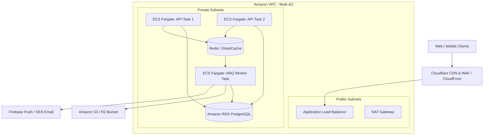

# PawGuard Production Infrastructure, Capacity Planning & Multi-Tier Sizing Guide

**Version**: 1.0  
**Target Environment**: AWS Production Ecosystem & Free/Open-Source Alternatives  
**Backend Framework**: FastAPI (AsyncIO) + PostgreSQL 16 + Redis (ARQ Worker)  

---

## 1. Executive Summary & Architecture Overview

PawGuard is designed with an **asynchronous, event-driven, decoupled architecture**. To guarantee sub-100ms API response times at scale and prevent heavy background tasks (PDF generation, bulk email dispatch, push notification bursts) from starving HTTP workers of CPU, the infrastructure separates:
1. **API Compute Layer**: Handles client requests via stateless, asynchronous FastAPI containers.
2. **Worker Compute Layer**: Dedicated background workers running ARQ pulling tasks from Redis queues.
3. **Data Layer**: Amazon RDS PostgreSQL with connection pooling and transactional isolation.
4. **Caching & Queue Layer**: Redis for sub-millisecond query caching, rate limiting, and job queues.



---

## 2. Comprehensive Service Matrix: AWS vs Free & Open-Source Alternatives

| Infrastructure Category | Service Requirement | AWS Managed Service (Paid) | Free / Open-Source / Low-Cost Alternative | Do We Need It in Phase 1? | Practical Recommendation |
| :--- | :--- | :--- | :--- | :--- | :--- |
| **Networking** | **DNS Management** | Amazon Route 53 | **Cloudflare DNS (Free)** | Optional (Use Cloudflare) | Cloudflare provides faster global resolution, instant TTL, and zero cost. |
| | **CDN & Edge Cache** | Amazon CloudFront | **Cloudflare CDN (Free)** | Yes | Cloudflare free tier offers unlimited egress bandwidth; CloudFront charges per GB. |
| | **SSL / TLS Certs** | AWS Certificate Manager (ACM) | **Let's Encrypt / Cloudflare SSL** | Yes (Free) | ACM is free when attached to an ALB; Cloudflare provides automatic edge SSL. |
| | **WAF / DDoS Shield** | AWS WAF ($5/mo + $1/rule) | **Cloudflare WAF (Free Tier)** | Optional | Cloudflare free tier handles Layer 7 DDoS, rate-limiting, and bot blocking out of the box. |
| | **Load Balancer** | Application Load Balancer (ALB) | **Nginx / Caddy / Traefik** | Yes (in AWS ECS) | Mandatory for Multi-AZ ECS Fargate. For single EC2, Nginx reverse proxy is sufficient. |
| | **Network Isolation** | Amazon VPC (Private Subnets) | **Docker Bridge / Tailscale** | Yes (AWS VPC) | AWS VPC is 100% free; you only pay for NAT Gateways ($32/mo). |
| | **Outbound Internet** | AWS NAT Gateway ($32/mo + GB) | **Fargate Public IP with Security Groups** | Optional in Dev | In Staging/Dev, run Fargate in public subnets with closed ingress to save $32/mo on NAT. |
| **Compute** | **Container Registry** | Amazon ECR | **GitHub Container Registry (GHCR)** | Optional | GHCR offers 500MB free storage and integrates seamlessly with GitHub Actions CI/CD. |
| | **API Container Runtime**| Amazon ECS Fargate | **Docker on EC2 / Render / Fly.io** | Yes (Production) | Fargate removes server patching, maintenance, and scales automatically. |
| | **Background Worker** | Amazon ECS Fargate (Worker) | **Same VM / In-Process Async** | Yes (Production) | Run as a dedicated task so heavy PDF/image generation never slows down the API. |
| | **Auto Scaling** | ECS Target Tracking Auto Scaling | **Docker Swarm / Kubernetes** | Yes (Stage 2 & 3) | Native AWS feature (Free); scales containers based on CPU (>70%) or Request Count. |
| **Database & Cache** | **Relational Database**| Amazon RDS PostgreSQL 16 | **Neon / Supabase / Self-hosted PG** | Yes (Production) | RDS Multi-AZ guarantees 99.95% uptime, automated backups, and Point-in-Time recovery. |
| | **In-Memory Cache** | Amazon ElastiCache (Redis) | **Upstash Redis (Serverless)** | Upstash in Dev | Upstash provides 10k free daily requests (zero idle cost). Use ElastiCache in high-scale prod. |
| | **Database Backups** | Automated RDS Snapshots | **`pg_dump` cron to S3 / R2** | Yes (RDS built-in) | RDS includes 7–35 days automated rolling snapshots with 0 overhead. |
| **Storage** | **Object Storage** | Amazon S3 | **Cloudflare R2 / MinIO (Self-hosted)** | Yes | Cloudflare R2 offers 10 GB free and **$0 egress fees**; S3 charges $0.09/GB egress. |
| | **Static Asset Serving**| S3 + CloudFront | **Cloudflare Pages / Vercel** | Yes | Free global edge delivery for user uploads, PDFs, and dog photos. |
| **Messaging & Queues** | **Job Queue** | Amazon SQS | **Redis Streams / ARQ (Built-in)** | **NO (Not needed)** | PawGuard already uses **ARQ on Redis**; SQS is redundant and adds latency. |
| | **Transactional Email** | Amazon SES ($0.10 / 1,000 emails) | **Resend / Brevo (Sendinblue)** | Yes | SES is the most cost-effective at scale ($1 for 10k emails). Resend is great for dev (3k free/mo). |
| | **SMS Alerts** | Amazon SNS ($0.05 / SMS) | **Twilio / Fast2SMS** | Optional | Only needed for critical OTPs/alerts. Push notifications should be prioritized over SMS. |
| | **Push Notifications** | Amazon SNS (Push) | **Firebase Cloud Messaging (FCM)** | **Use FCM (Free)** | **FCM is 100% free** with unlimited pushes for Android & iOS. SNS is unnecessary for push. |
| **Security & Secrets** | **Secrets Management** | AWS Secrets Manager ($0.40/secret)| **Doppler / Infisical / `.env` files**| Optional | Doppler / Infisical provide generous free tiers for developer environment variables. |
| | **Config Store** | Systems Manager Parameter Store | **Environment Variables / Doppler** | Optional | SSM Standard parameters are 100% free. |
| | **IAM & KMS** | AWS IAM & AWS KMS | **OpenSSL / Built-in Cryptography** | Yes (AWS Native) | Standard AWS IAM roles (Free); KMS default keys (Free). |
| **Monitoring** | **Metrics & Dashboards**| CloudWatch ($0.50/metric) | **Grafana Cloud Free / Prometheus** | Yes (Hybrid) | Grafana Cloud Free gives 10k metric series & 50 GB logs free. CloudWatch for container health. |
| | **Error Tracking** | AWS CloudWatch Logs | **Sentry (Free Developer Tier)** | Yes | Sentry provides 5,000 free errors/month with full stack traces and breadcrumbs. |
| **CI/CD & IaC** | **Source & CI/CD** | GitHub Actions | **GitLab CI / Jenkins** | Yes | GitHub Actions gives 2,000 free build minutes/month for Docker image builds & Alembic migrations. |
| | **Infrastructure as Code**| Terraform + S3 State | **OpenTofu / Pulumi** | Yes | Terraform state stored in S3 + DynamoDB lock table (Costs < $0.05/month). |

---

## 3. External Third-Party Services Utilized by PawGuard

| External Service | Purpose in Backend | Free Tier Allowance | Production Paid Tier |
| :--- | :--- | :--- | :--- |
| **Razorpay / Stripe** | Donation checkout, sponsorship subscriptions, and adoption fee collection. | Free setup (Pay per transaction: 2% + GST). | Pay-as-you-go per successful transaction. |
| **Firebase (FCM)** | Real-time push notifications for lost pet alerts, rescue dispatches, and appointment updates. | **100% Free** (Unlimited push notifications). | Free permanently. |
| **Mapbox / OpenStreetMap** | Reverse geocoding and live ambulance/rescue vehicle GPS tracking. | 50,000 free map loads/month. | Pay-per-load after 50k. |
| **Resend / AWS SES** | Automated 80G tax receipts, adoption agreements, password resets, and email verification. | 3,000 free emails/mo (Resend) / $0.10 per 1k (SES). | ~$2 – $5 / month. |

---

## 4. Multi-Tier Capacity Planning & Instance Sizing Matrix

### **Why 1 Fargate API Task Handles Thousands of Users:**
FastAPI operates on Python's **Asynchronous AsyncIO Event Loop**. Unlike legacy synchronous frameworks (Django/Flask) that block a whole thread per request, FastAPI handles hundreds of concurrent I/O operations simultaneously while waiting for database or cache responses.

```
Real-World Traffic Math:
• Average user browsing PawGuard makes 1 request every 6 to 10 seconds.
• 1 Fargate Task (1 vCPU, 2 GB RAM) easily processes 400 to 700 requests/second.
• 500 req/sec × 8 seconds average user think-time = 4,000 simultaneous active users!
```

---

### **Tier Sizing Comparison Table**

| Metric / Resource | Tier 1: Staging & Internal (20 Users) | Tier 2: Production Launch (2,000 Active Users) | Tier 3: High-Scale Growth (20,000 Active Users) |
| :--- | :--- | :--- | :--- |
| **Target Workload** | Dev, QA testing, Admin staff (20 users) | Public website + Rescue App (2k users, ~25k DAU) | Statewide / Multi-city adoption network (20k users, ~250k DAU) |
| **Peak Throughput** | 5 – 15 requests / sec | 150 – 350 requests / sec | 1,500 – 3,500 requests / sec |
| **API Compute (ECS)** | **1x Task** (0.25 vCPU, 0.5 GB RAM) | **2x Tasks** (0.5 vCPU, 1 GB RAM each) Multi-AZ | **4x to 8x Tasks** (1 vCPU, 2 GB RAM each) Auto-scaled |
| **Worker Compute (ECS)**| **1x Task** (0.25 vCPU, 0.5 GB RAM) | **1x Task** (0.5 vCPU, 1 GB RAM) Dedicated | **2x Tasks** (1 vCPU, 2 GB RAM each) Dedicated |
| **Alternative EC2 Setup**| 1x `t4g.micro` or `t4g.small` (All-in-one) | 1x `t4g.medium` (2 vCPU, 4 GB RAM) | 2x `c7g.xlarge` (4 vCPU, 8 GB RAM each) behind ALB |
| **Database (PostgreSQL)**| Amazon RDS `db.t4g.micro` (or Neon Free) | Amazon RDS `db.t4g.small` (2 vCPU, 2 GB RAM) | Amazon RDS `db.m7g.large` (2 vCPU, 8 GB RAM) + **1x Read Replica** |
| **Database Storage** | 20 GB gp3 SSD | 50 GB gp3 SSD (Autoscaling to 200 GB) | 250 GB gp3 SSD (Provisioned 3,000 IOPS) |
| **Redis Caching & Queue**| Upstash Redis (Free Tier) | Upstash Pro or ElastiCache `cache.t4g.micro` | Amazon ElastiCache `cache.t4g.small` (Multi-AZ Cluster) |
| **Object Storage (Media)**| Cloudflare R2 (Free 10 GB) or S3 Standard | Amazon S3 Standard (100 GB) + Cloudflare CDN | Amazon S3 Standard (1 TB) + S3 Intelligent-Tiering |
| **Estimated AWS Cost** | **$15 – $35 / month** *(or $7/mo on EC2)* | **$85 – $135 / month** | **$320 – $490 / month** |

---

## 5. In-Depth Comparison: AWS ECS Fargate vs AWS EC2

### **Option A: AWS ECS Fargate (Serverless Container Platform)**
* **Architecture**: AWS manages the underlying EC2 instances, OS patches, networking drivers, and scaling. You only manage the Docker image.
* **Pros**:
  * **Zero Server Management**: No Linux kernel updates, security CVE patching, or SSH key management.
  * **True Zero-Downtime Rolling Deploys**: Automatically starts the new version container, verifies healthy HTTP 200 status, and terminates old containers seamlessly.
  * **Isolated Background Workers**: Easy to run the API and Background Worker as separate tasks with dedicated CPU allocations.
  * **Built-in Auto-Scaling**: Scales from 2 to 10 tasks in under 60 seconds during traffic surges.
* **Cons**:
  * ~15% higher compute cost per vCPU hour compared to reserved EC2 instances.

### **Option B: AWS EC2 (Virtual Linux Server / Docker Compose)**
* **Architecture**: You provision an Ubuntu virtual machine, install Docker & Nginx, and run `docker compose up`.
* **Pros**:
  * **Maximum Cost Efficiency in Stage 1 (<500 users)**: You can run API + DB + Redis + Nginx on a single **`t4g.small` ($10/month)** instance.
* **Cons**:
  * **Single Point of Failure**: If the VM runs out of memory or crashes, all services go down together.
  * **Manual Maintenance Burden**: Must configure firewall (UFW/Security Groups), log rotation, disk cleanup, SSL cert renewals, and OS patches.
  * **Complex Scaling**: Adding more servers requires manually setting up Load Balancers, shared databases, and synchronization.

### **Engineering Verdict:**
* **For 20 Members (Stage 1)**: Use a single EC2 instance (`t4g.small`) or Render / Fly.io for minimal cost.
* **For 2,000 to 20,000+ Members (Stage 2 & 3)**: **AWS ECS Fargate is strongly recommended**. The zero-maintenance overhead, automated rolling updates, and complete isolation of the background worker far outweigh the small cost difference.

---

## 6. Background Worker Isolation Architecture

```
                                  +---------------------------------------+
                                  |         FastAPI Web API (ECS)         |
                                  | (Non-blocking I/O, Sub-100ms Latency) |
                                  +-------------------+-------------------+
                                                      |
                                                      | 1. Enqueue Job (e.g. PDF/Email)
                                                      v
                                  +---------------------------------------+
                                  |              Redis Queue              |
                                  +-------------------+-------------------+
                                                      |
                                                      | 2. Pull Job Asynchronously
                                                      v
+---------------------------------------------------------------------------------------------------------+
|                                    ARQ Background Worker (ECS Task)                                      |
|                                                                                                         |
|  [PDF Adoption Agreement Generator]      [Bulk Notification Broadcaster]      [Image Thumbnail Resizer] |
|   (Consumes CPU: 100% for 1.2s)          (Sends 500 FCM Pushes / 1.5s)        (Saves Optimized S3 WebP) |
+---------------------------------------------------------------------------------------------------------+
```

### **Why Isolation is Mandatory:**
1. **Zero Impact on HTTP Latency**: Heavy PDF rendering (WeasyPrint / ReportLab) or mass email dispatch consumes significant CPU cycles. Isolating this work in a dedicated worker task ensures the API container maintains **100% available CPU for public users and QR scans**.
2. **Crash Resilience**: If a corrupt image or malformed PDF causes a memory spike in the worker, only the worker task restarts; **the public web API and user mobile apps remain 100% online**.
3. **Independent Scaling**: On adoption campaign days, you can scale the worker tasks to 3 instances while keeping API tasks at 2 instances.

---

## 7. Actionable Implementation Checklist for DevOps

1. **Networking**: Configure VPC with 2 Public Subnets (ALB) and 2 Private Subnets (ECS & RDS) across `us-east-1a` and `us-east-1b`.
2. **DNS & CDN**: Route traffic through **Cloudflare** for free DDoS protection, WAF, and global static caching.
3. **Database**: Provision Amazon RDS PostgreSQL 16 on `db.t4g.small` with Automated Snapshots enabled (7-day retention).
4. **Cache**: Start with **Upstash Redis Serverless** (Dev/Launch) and migrate to **Amazon ElastiCache** when exceeding 10k active users.
5. **Compute**: Deploy 2 ECS Fargate services (`pawguard-api` and `pawguard-worker`) pulling Docker images from GitHub Container Registry or Amazon ECR.
6. **Migrations**: Run `alembic upgrade head` in CI/CD pipeline before switching ALB traffic to new ECS task versions.
